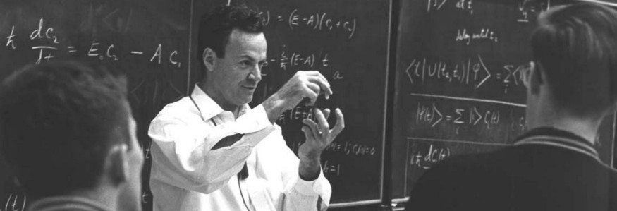

Richard Feynman needs no introduction, being the renowned theoretical physicist who played drums and worked on the Manhattan Project. I came to know about him from countless tweets and YouTube videos, but I started to learn more about him during my journey to understand first principles thinking.

“*I don’t know what’s the matter with people: they don’t learn by understanding; they learn by some other way — by rote or something. Their knowledge is so fragile!*” ~ Richard Feynman

I got drawn to this quote because I could relate to it. My knowledge was fragile. I learned by rote. To know more about his thoughts, I read “Surely You’re Joking, Mr. Feynman!” which covered a variety of instances from his life.

There were many places where I couldn’t understand him. Maybe it was the physics part or maybe the level at which he thought. There were some things that I could relate to. The chapter in which he describes how he handled the ants running around in his room was fun and I decided to try his method. It blew my mind that a world-renowned physicist and I had faced the same problem.

“*O Americano, Outra Vez!*” was the chapter where he talked about the education system in Brazil — how the students used to memorize everything for the exams and didn’t even think about the practical applications. They couldn’t answer the questions about the same topics they memorized when asked indirectly. Mr. Feynman gives an analogy of a Greek scholar to make us understand how students learned in Brazil.

What this Greek scholar discovers is, the students in another country learn Greek by first learning to pronounce the letters, then the words, and then sentences and paragraphs. They can recite, word for word, what Socrates said, without realizing that those Greek words actually mean something. To the student they are all artificial sounds. Nobody has ever translated them into words the students can understand.

I said, “*That’s how it looks to me, when I see you teaching the kids ‘science’ here in Brazil.*” (Big blast, right?)

This was too close to home for me. The book was first released in 1985, and I don’t know whether the education system changed in Brazil or not but here in India, it remains the same. I had a math teacher who could write and solve all the questions in the textbook from memory. We used to joke that she could even write down all those problems on the board with her eyes closed. Now I realize that for more than five years, she used to solve the same problem for each batch of students and we used to write it down, learn it (memorize it) and answer the same questions for our exams (of course, the numerical values would be different).

Even now as I’m studying engineering, the methods by which students are being taught and how the students learn haven’t changed. Everyone complains about the education system but very few try to change the way they are learning.

Mr. Feynman also made a discovery that when people start learning on their own, it made a significant impact on their understanding of the topic.

History classes used to bore me; I slept during them. Once I started to learn by myself about the French Revolution, The World Wars, and the Cold War, it became interesting. I had many doubts, so I read more books to find answers. I understood the subject, unlike myself in ninth grade. I even made some memes on the topic.

Right now, the days of the pandemic are dark, and the freedom and time to learn what I want is a ray of light for me. The cogs of the education system could not adapt immediately to the pandemic. I am reading a lot, and this has led me to discover something I am passionate about, and I have decided to pursue it.

I am a product of a bad education system and I accept it. I can continue blaming the education system — which I believe won’t change anytime soon — or I can change how I learn.

Identify a method to learn, to think. When I come across an interesting topic, I initially read articles related to it. If the interest persists, then read at least three books on the topic. Think about it. Write about it. Search for communities where you can find peers. Engage in conversations. Make memes on it. Once you understand the topic, it is fun and satisfying to teach others.

Mr. Feynman taught me that reciting facts is cheap — Learning to think is priceless.